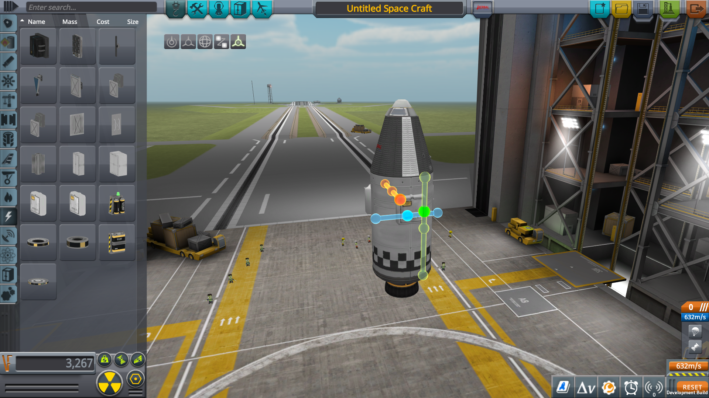

AdjustmentTool
==============

Overview
--------

A tool for the KSP editor to align parts with precision. To activate the tool,
use the button to the right of the reroot tool and select a surface attached
part. Three axes will appear. Each axis has a draggable handle indicated by an
opaque sphere in addition to several markers that are located at precise
positions along the axis. Drag the handle to move the part along that axis.

Use the hotkeys to increase and decrease the symmetry mode (X and Shift+X by
default) to change the number of markers on each axis.

When angle snap is enabled, the handle will "snap" to each marker so that you
can precisely position parts at marked intervals along each axis.

When the tool is active, it's also possible to designate arbitrary parts as the
reference parts for the tool. Select (and deselect) reference parts with Left
Shift + Click. Reference parts are highlighted in blue. To clear the reference
part list, Left Shift + Click on an area with no part. When no reference parts
are selected, the parent part is used.

Limitations
-----------

This is an alpha release of this mod. As a result, a number of features need to
be implemented.

- It doesn't work yet in the Spaceplane Hanger
- The coordinate space button or hotkey doesn't do anything
